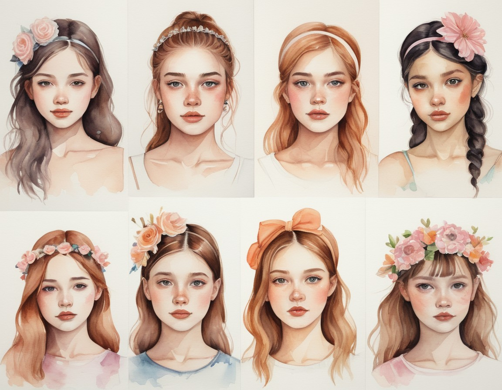

# 把SD装到包里！轻量级的stable diffusion应用:fire:StableVerse开源发布


StableVerse是一个用C++开发的本地运行的图形工具。适合初学者快速入门；适用于办公室工作人员的文本和图像制作的小规模计算能力场景。

开源链接：https://github.com/kelvin-luo/StableVerse.git


## :rocket:特性:

-**新手友好**：预先配置多个主流型号，帮助初学者快速进入角色；
-**选定案例**：整合最佳实践以快速生成图像；
-高性能：用C++编写，可直接访问硬件；
-**轻便**：体积更小；
-**离线**：独立型号，可定制。它可以在没有限制或互联网连接的情况下使用。
-**隐私保护**：本地模式，本地运行。


## 平台支持

支持跨平台运行。目前在windows下测试良好。理论上支持linux，mac环境。 


## 硬件依赖

硬件需要英伟达显卡6G显存，目前适配cuda12.9.


## :tada:例子

anime：

```
"1 girl," 
negative: "bad hands, text, error, missing fingers, extra digit, fewer digits, cropped, worst quality, low quality, normal quality, jpeg artifacts, signature, watermark, username, blurry, Missing limbs, three arms, bad feet, text font ui, signature, blurry, malformed hands, long neck, mutated hands and fingers :1.5).(long body :1.3),(mutation ,poorly drawn :1.2), disfigured, malformed, mutated, multiple breasts, futa, yaoi, three legs, huge breasts,"
```


style avatar:

```shell
"The composition is divided into top, bottom, left, and right arrangements, with a watercolor style. There are six girl portraits with different expressions, skin tones, hair colors, appearances, clothing, and hair accessories. The colors are rich and full, the lighting is soft, and the background is a simple gradient color" 
```



logo:

```shell
"A simple creative logo,Side wolf head image,centre,In a minimalist style,Tattoo style,Logo design,color lump,Minimalist style"
```


## 安装

**预编译包下载链接:**

https://github.com/kelvin-luo/StableVerse/releases/download/V20250723/StableVerse_v1.0_MSVC2019_v20250723.7z

sha256:775b45a60331c0d6546e41adee2f93c700aa2105e166acbb3dca874b2a8bea5c

**模型下载:**

通过网盘分享的文件：models
链接: https://pan.baidu.com/s/1hAve7jp1HlVwV3GIfu_n1w?pwd=vgqi 提取码: vgqi 
--来自百度网盘超级会员v4的分享


## :pushpin: 用法


# ❤捐助

Developing software is not easy,if you like this software, please provide support❤️!Please follow my website,thank you to every star⭐ !


# :revolving_hearts:致谢

comfyui： https://github.com/comfyanonymous/ComfyUI

stable-diffusion-webui: https://github.com/AUTOMATIC1111/stable-diffusion-webui

stable-diffusion.cpp: https://github.com/leejet/stable-diffusion.cpp

SimpleSDXL: https://github.com/metercai/SimpleSDXL

Qt: https://qt-project.org


## 相关链接：

https://www.cnblogs.com/leoking01/p/19001855

https://zhuanlan.zhihu.com/p/1931489073253581941

CSDN:本地运行C++版StableDiffusion！开源应用StableVerce发布 : https://blog.csdn.net/leoking01/article/details/149584990?spm=1011.2415.3001.5331


